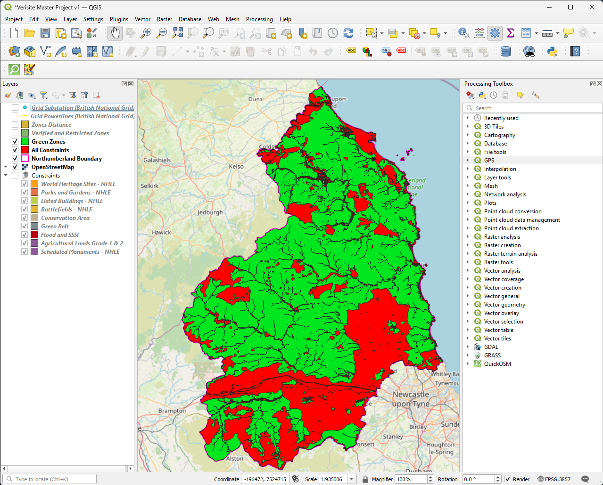
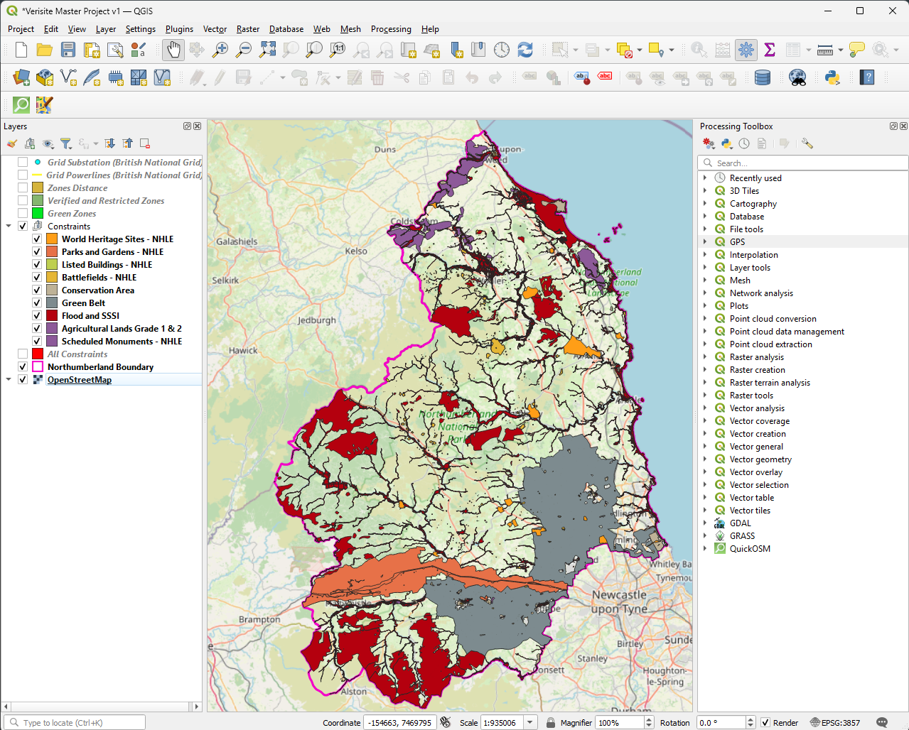
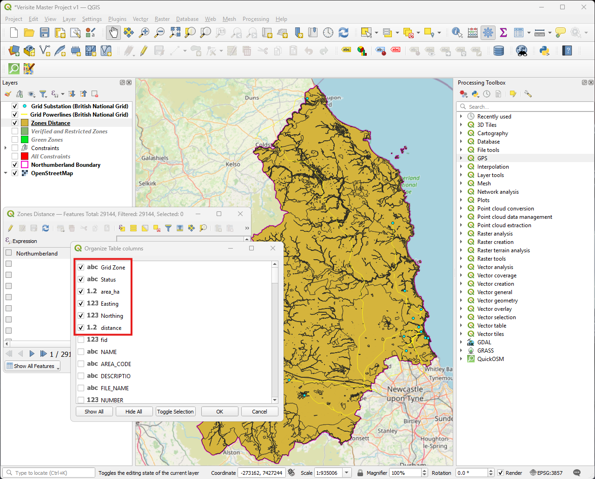

# ☀️ Verisite: Solar Land Viability Assessment (GIS Data Pipeline)

*Figure 1: Overview of Northumberland showing Restricted (Red) and Verified (Green) land parcels based on spatial constraints.*

## 📌 Overview
Verisite is a spatial intelligence data pipeline designed to accelerate the preliminary Due Diligence phase for utility-scale solar energy development in the UK. 

This repository showcases the core backend **GIS Database Development**. It demonstrates the automated identification, filtering, and assessment of optimal land parcels by integrating complex UK urban planning regulations, environmental constraints, and electrical grid infrastructure data.

> **Note:** The interactive front-end web application for this data is currently under development. The documentation below relies on visual outputs and data tables directly from the GIS processing environment.

## 🎯 The Problem
Finding developable land for renewable energy projects involves navigating a labyrinth of spatial constraints. Developers often waste significant time assessing plots that are ultimately unviable due to hidden planning restrictions (e.g., Green Belt policies) or excessive distance from grid connection points.

## 💡 Methodology & Visual Proof of Concept
The following workflow illustrates the robust GIS data pipeline built to filter and score land parcels in Northumberland:

### 1. Constraint Mapping (The "No-Go" Zones)
Aggregation and integration of restrictive layers to form a unified exclusion zone. Constraints include:
* Green Belt and AONB (Area of Outstanding Natural Beauty)
* Flood Zones (Environment Agency data)
* Scheduled Monuments and Heritage Sites
* Agricultural Land Classifications

*Figure 2: Aggregated spatial constraints forming the restricted zones.*

### 2. Viability Extraction
Utilizing advanced spatial operations (Difference algorithms, Multipart geometry standardization) to extract pristine, developable land parcels from the baseline map.

### 3. Grid Proximity Engine
Calculating exact distances from verified land parcels to the nearest National Grid substations using nearest-neighbor spatial joins.

*Figure 3: Spatial SQL used in the Attribute Table to categorize parcels into commercial viability zones (e.g., 0-2 km, 2-10 km) based on grid distance.*

## 🛠️ Tech Stack & Skills Demonstrated
* **Geospatial Analysis:** QGIS, Vector geometry processing, Spatial Joins.
* **Database Management:** Spatial SQL (Field Calculator), GeoPackage architecture.
* **Domain Expertise:** UK Town and Country Planning regulations, Renewable Energy infrastructure planning.

## 👨‍💻 About the Developer
Developed by an Urban Planning Master's student and Chevening Scholar based at Newcastle University. This project bridges the gap between academic urban theory and practical, tech-driven solutions for real-world environmental challenges. 

*Let's connect!*
🔗 [My LinkedIn Profile](https://www.linkedin.com/in/shahin-younesi-a695ab387?utm_source=share_via&utm_content=profile&utm_medium=member_android)# 
